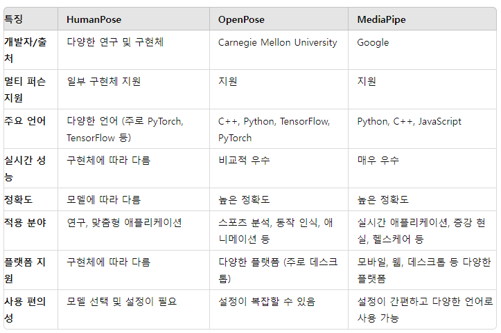

# openpose란?
실시간 다중인 2D 자세 추정

## 구현단계
1. 기술선택
   - 프레임워크:tensorflow, pytorch
   - 포즈추정모델: OpenPose, MediaPipe, AlphaPose
   - 실시간 비디오 처리 : OpenCV
   - 
2. 자세 추정모델 설정
   - 동영상에서 사람의 관절 위치 추정
  
3. 데이터 준비
   - 동영상 수집
   - 전처리(프레임 추출, 프레임에서 관절 위치를 추정)
  
4. 모델 학습

```
import numpy as np
from sklearn.model_selection import train_test_split
from sklearn.ensemble import RandomForestClassifier

# 예시: 포즈 데이터를 사용한 학습 (관절 위치 x, y 좌표)
X = []  # 관절 위치 데이터
y = []  # 레이블 (올바른 자세: 1, 잘못된 자세: 0)

# 데이터 수집 (여기서는 예시로서 데이터를 생성)
# 실제로는 포즈 추정 모델을 사용하여 데이터를 추출
for frame in video_frames:
    pose = extract_pose(frame)  # 관절 위치 추출 함수
    X.append(pose)
    y.append(label)  # 해당 프레임의 레이블 추가

X = np.array(X)
y = np.array(y)

# 학습/검증 데이터 분리
X_train, X_test, y_train, y_test = train_test_split(X, y, test_size=0.2)

# 모델 학습
clf = RandomForestClassifier()
clf.fit(X_train, y_train)

# 모델 평가
accuracy = clf.score(X_test, y_test)
print(f"Accuracy: {accuracy}")

```

5. 실시간 자세 교정 시스템 구현

```
import cv2
import time

# 웹캠에서 비디오 스트림 읽기
cap = cv2.VideoCapture(0)

while True:
    ret, frame = cap.read()
    if not ret:
        break

    # 포즈 추정
    pose = extract_pose(frame)
    
    # 자세 교정
    prediction = clf.predict([pose])[0]
    
    if prediction == 0:
        feedback = "Correct your posture"
    else:
        feedback = "Good posture"

    # 화면에 피드백 표시
    cv2.putText(frame, feedback, (10, 30), cv2.FONT_HERSHEY_SIMPLEX, 1, (0, 255, 0), 2)
    cv2.imshow("Posture Correction", frame)
    
    if cv2.waitKey(1) & 0xFF == ord('q'):
        break

cap.release()
cv2.destroyAllWindows()

```

## 자세추정 모델 선택
### HumanPose
"HumanPose"는 특정 라이브러리나 프레임워크를 의미하기보다는, 일반적으로 사람의 자세 추정을 위한 모델이나 알고리즘을 지칭하는 용어입니다. 다양한 연구와 구현체가 존재하며, 이를 바탕으로 여러 라이브러리나 툴킷이 개발되었습니다.

- 유연성: 다양한 알고리즘과 모델을 사용하여 사람의 자세를 추정할 수 있음.
- 커스터마이징: 연구 목적이나 특정 요구사항에 맞게 모델을 커스터마이징 가능.
- 예시 구현체: Simple Baselines for Human Pose Estimation and Tracking (PyTorch), HRNet 등.

### OpenPose
OpenPose는 Carnegie Mellon University에서 개발된 사람의 포즈 추정 라이브러리로, 높은 정확도와 성능을 자랑합니다. 특히, 멀티 퍼슨 포즈 추정이 강력합니다.

**주요 특징**
- 멀티 퍼슨 포즈 추정: 여러 사람의 포즈를 동시에 추정 가능.
- 다양한 출력: 몸, 얼굴, 손의 랜드마크를 추출 가능.
- 고성능: 비교적 높은 정확도와 성능을 제공.
- 라이브러리 및 프레임워크: Caffe, TensorFlow, PyTorch 등 다양한 프레임워크 지원.
- 응용 사례: 스포츠 분석, 동작 인식, 애니메이션 등.

### MediaPipe
MediaPipe는 Google에서 개발한 크로스 플랫폼 프레임워크로, 실시간으로 동영상 처리를 위한 다양한 솔루션을 제공합니다. 포즈 추정 외에도 얼굴 인식, 손 추적 등의 다양한 기능을 포함하고 있습니다.

**주요 특징**
- 실시간 성능: 모바일과 웹에서 실시간으로 작동하도록 최적화.
- 다양한 모듈: 포즈 추정, 얼굴 인식, 손 추적 등 여러 모듈을 포함.
- 간편한 사용: Python, C++, JavaScript 등 다양한 언어로 사용 가능.
- 다양한 플랫폼 지원: Android, iOS, 웹, 데스크톱 등.
- 적용 사례: 실시간 애플리케이션, 증강 현실, 헬스케어 등.



**결론**
- HumanPose: 연구 목적이나 특정 요구사항에 맞게 다양한 모델을 사용하고자 할 때 유용합니다.
- OpenPose: 높은 정확도와 성능이 필요하며, 멀티 퍼슨 포즈 추정이 중요한 경우에 적합합니다.
- MediaPipe: 실시간 성능이 중요하고, 모바일이나 웹 애플리케이션에 적용하려는 경우에 매우 유용합니다.


## 데이터 출처

- [매트랩-자세교정모델](https://www.mathworks.com/matlabcentral/fileexchange/132857-matlab-ai-2023_)
- [lstm, mediapipe 사용 걷기뛰기 분류모델](https://blog.naver.com/112fkdldjs/222972860886)
- [mediapipe_guide](https://ai.google.dev/edge/mediapipe/solutions/guide?hl=ko)
- [mediapipe_guide](https://ai.google.dev/edge/mediapipe/solutions/guide?hl=ko)